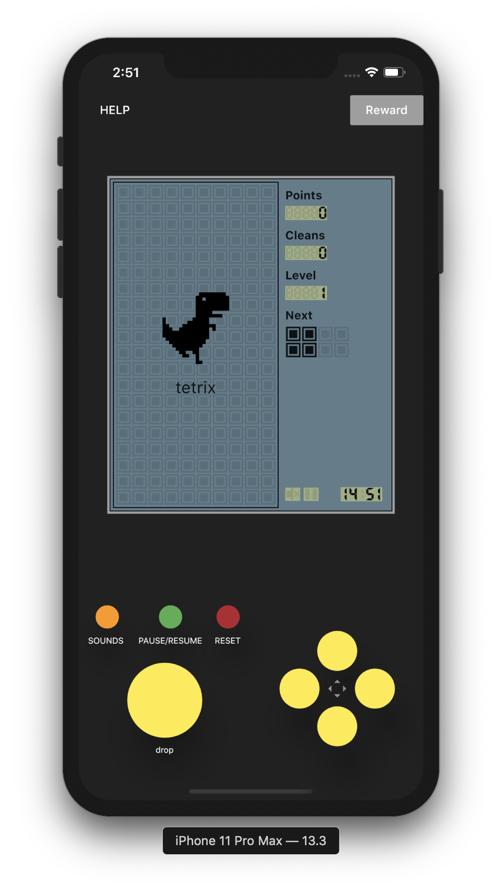
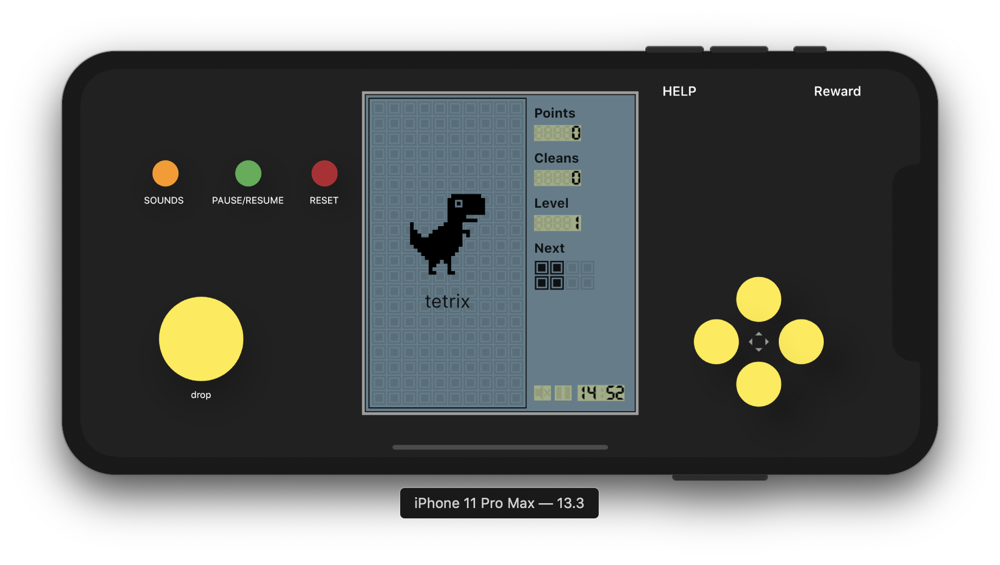
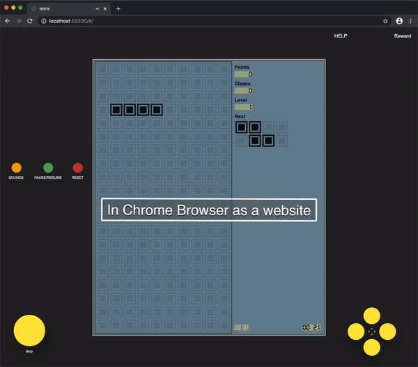
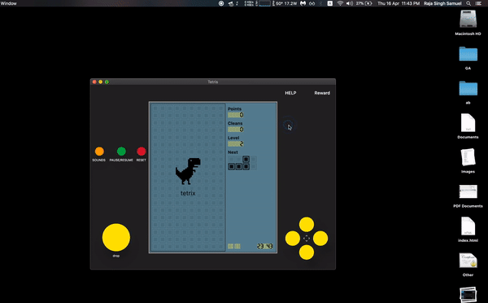

### Flutter Tetris
  [-blue.svg)](https://github.com/996icu/996.ICU/blob/master/LICENSE)

---

Use the Tetris game developed by Flutter. Supports ** Android **, ** iOS **, ** Windows **, ** mac **, ** Linux ** and ** web **.

The reference comes from [vue-tetris](https://github.com/Binaryify/vue-tetris).

## How to get started

* Compile yourself

  Install [Flutter] (https://flutter.io/docs/get-started/install)

  Enter at the command line: `flutter run --profile`

* Go to [Release] (https://github.com/samuelrajasingh/tetris/releases/) to download the Apk / macOS / Windows executable file--COMING SOON --.

* Or go to [https://boyan01.github.io/flutter-tetris](https://boyan01.github.io/flutter-tetris/#/) to experience the web version

## Effect preview
In Iphone 11 pro max ->

</img>

</img>

As a Website ->

</img>
As a mac app->

</img>

## Other
Star the repo if you like it

MIT with 996 License
